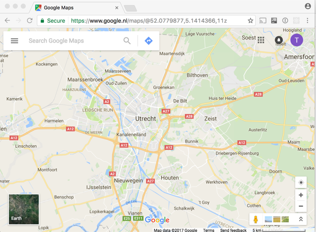
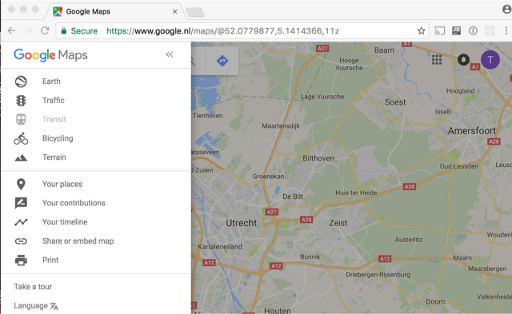
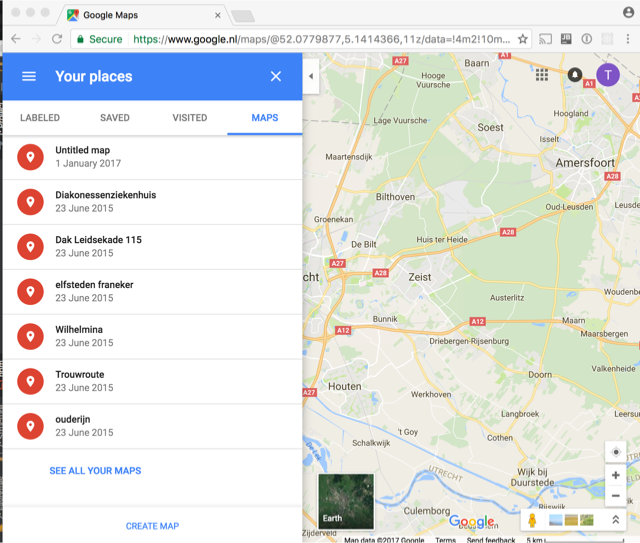
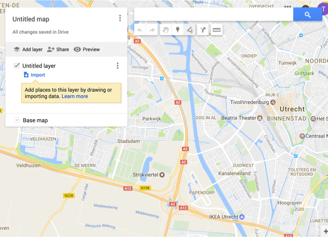
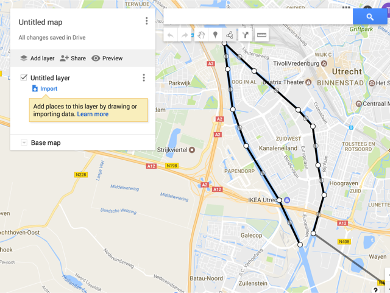
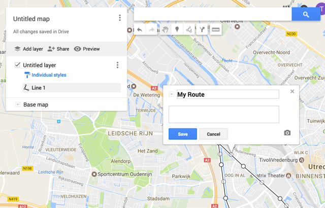
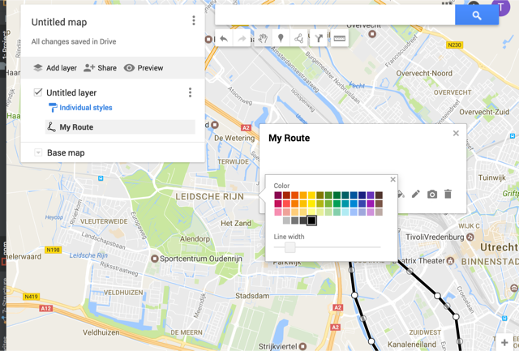
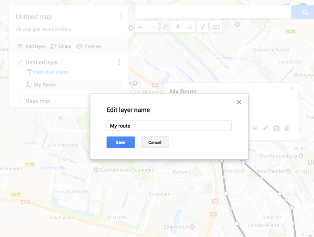
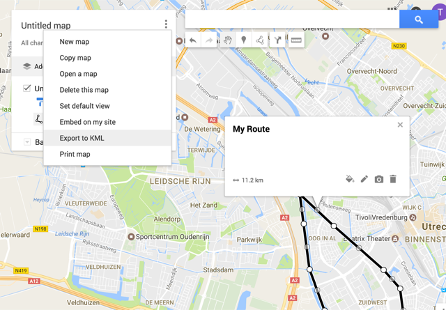
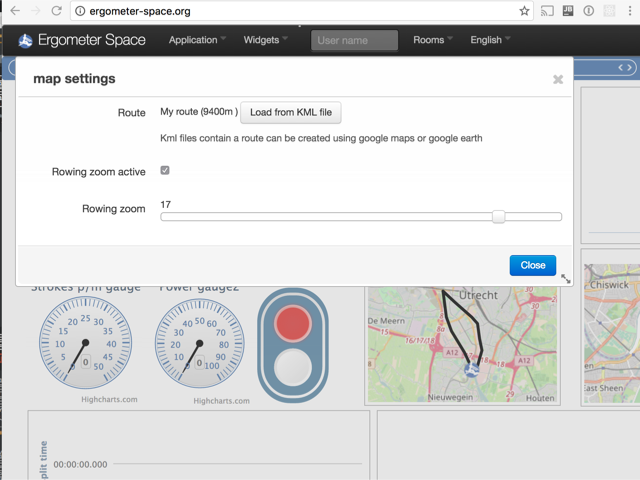

##Create an map with a route for ergometer space
Create a route with google maps and import it into the ergometer space maps widget

First start google maps and make sure that you are logged in into google



open the menu and start your places


goto maps and choose create map



choose the draw line tool



Draw a route. It must sinle set a set of connected lines. Just click on the points where you want the line.
the application does not support closed lines. Just let the end point stop close to the start point if you want a round track.



Double click on the last point . a dialog opens , give the route a name and save.



click on the style and increase the line width



Open the menu on the the untiled layer and chose rename layer

give the layer an name


open the top menu and choose export to KML


Choose the layer name which you have given
Check the checkbox export to a .KML file

then press download

now you have a file which looks like this:

`<?xml version='1.0' encoding='UTF-8'?>
<kml xmlns='http://www.opengis.net/kml/2.2'>
	<Document>
		<name>My route</name>
		<Placemark>
			<name>My Route</name>
			<styleUrl>#line-000000-4-nodesc</styleUrl>
			<LineString>
				<tessellate>1</tessellate>
				<coordinates>5.104351,52.0521738,0.0 5.0967979,52.0620955,0.0 5.0847816,52.0742308,0.0 5.0799751,52.0823543,0.0 5.0780869,52.0913202,0.0 5.0768852,52.0971206,0.0 5.0876999,52.0908983,0.0 5.1036644,52.0822489,0.0 5.1089859,52.0785565,0.0 5.1108742,52.0699047,0.0 5.1131058,52.0632564,0.0 5.1091576,52.0547072,0.0</coordinates>
			</LineString>
		</Placemark>
		
		
		<StyleMap id='line-000000-4-nodesc'>
			<Pair>
				<key>normal</key>
				<styleUrl>#line-000000-4-nodesc-normal</styleUrl>
			</Pair>
			<Pair>
				<key>highlight</key>
				<styleUrl>#line-000000-4-nodesc-highlight</styleUrl>
			</Pair>
		</StyleMap>
	</Document>
</kml>`****

go to the ergometer space and click on the tool buton on the map plugin

Click on load file



Now the route looks like this:



